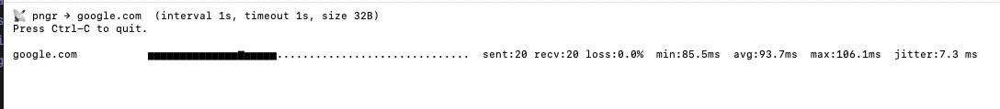

# pngr

pngr is a fast, async ICMP latency visualizer written in Rust. It measures round-trip latency and packet loss in real time and renders the results as clean ASCII sparklines directly in your terminal. Designed to be minimal, cross-platform, and terminal-native.

## Prerequisites

- [Rust](https://www.rust-lang.org/tools/install) 1.74 or newer (the project targets the 2024 edition).
- A recent version of Cargo (installed alongside Rust).
- macOS, Linux, or Windows with permission to send ICMP echo requests.
  - Raw socket support is preferred; when unavailable, pngr falls back to the system `ping` command.

## Getting Started

```bash
# Clone the repository
git clone https://github.com/<your-org-or-user>/pngr.git
cd pngr

# Build the project
cargo build

# Run pngr with the default settings
cargo run
```

The first run will fetch dependencies; subsequent builds are fast thanks to Cargo’s incremental compilation.

## Usage

pngr is a standard Cargo binary. You can run it directly with `cargo run --` or from the compiled executable in `target/debug/pngr` (or `target/release/pngr` after `cargo build --release`).

```bash
cargo run -- --host example.com --interval 500ms --timeout 1s --size 64 --history 80
```

### Flags

| Flag            | Description                                             | Default      |
|-----------------|---------------------------------------------------------|--------------|
| `--host`        | Hostname or IP address to ping                          | `localhost`  |
| `--interval`    | Delay between pings (supports human-friendly durations) | `1s`         |
| `--timeout`     | Timeout for each ping                                   | `1s`         |
| `--count`       | Number of pings to send (`0` means run until Ctrl-C)    | `0`          |
| `--size`        | Payload size in bytes                                   | `32`         |
| `--history`     | Sparkline width (number of samples retained)            | `50`         |
| `--no-raw`      | Force fallback mode using the system `ping` command     | disabled     |

When running without `--no-raw`, pngr attempts to use raw ICMP sockets through the [`surge-ping`](https://crates.io/crates/surge-ping) crate. If that fails (for example, due to insufficient privileges on the current platform), the tool automatically falls back to shelling out to the system `ping`.

## Screenshots



## Development

Helpful Cargo commands:

- `cargo check` – quick syntax/type check without building artifacts.
- `cargo fmt` – format the code using `rustfmt`.
- `cargo clippy` – run the Clippy linter (requires installing `clippy` via `rustup component add clippy`).
- `cargo test` – run tests (none yet, but hooks are ready for future work).

Contributions are welcome! Feel free to open issues or pull requests with ideas, bug reports, or improvements.

## License

Licensed under the GNU GPL v3.0. See [LICENSE](LICENSE) for details. This project is provided "as is", without warranty of any kind; no express or implied warranty is given, and use is at your own risk.
